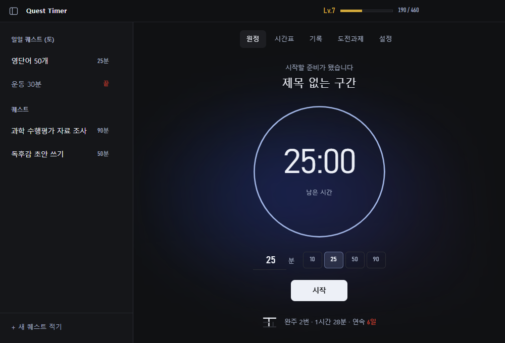
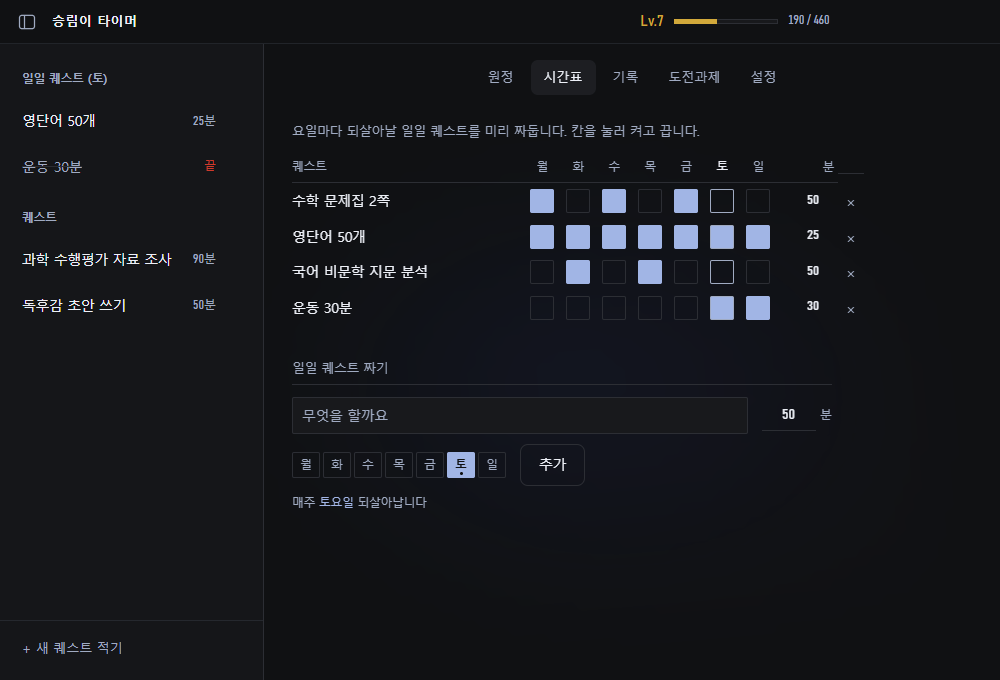
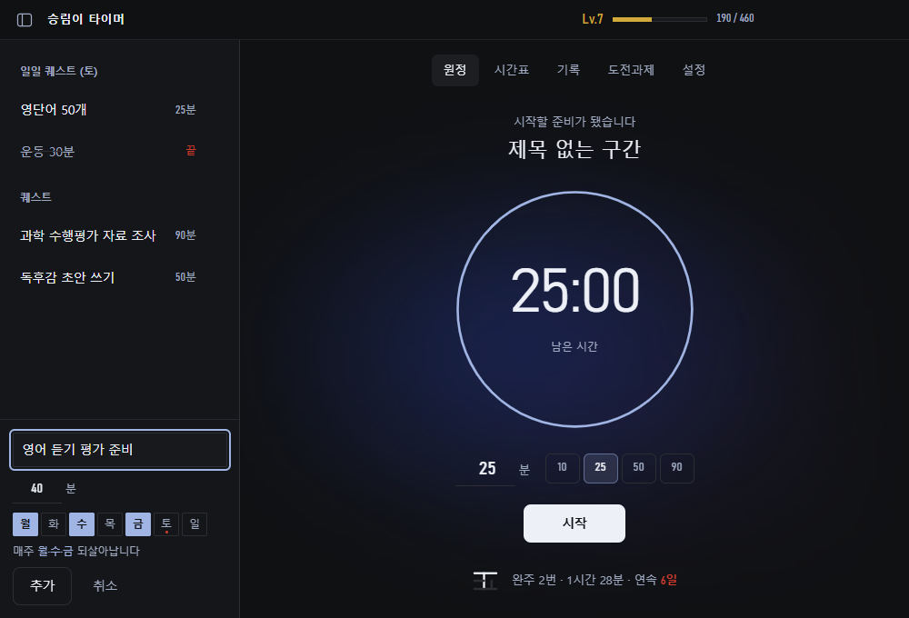
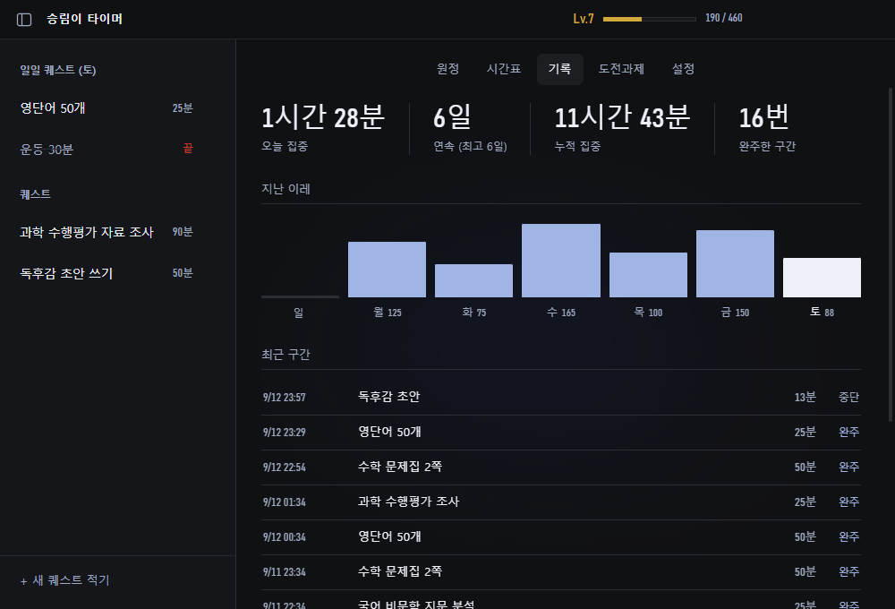
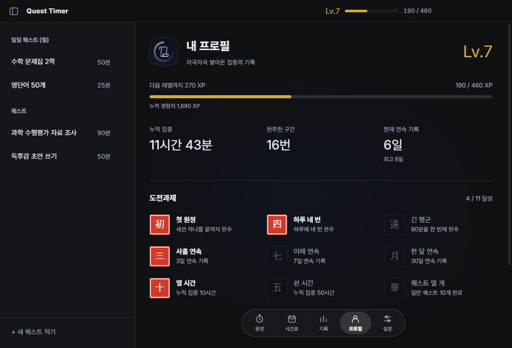
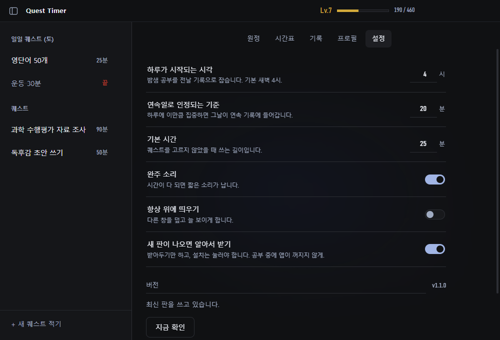
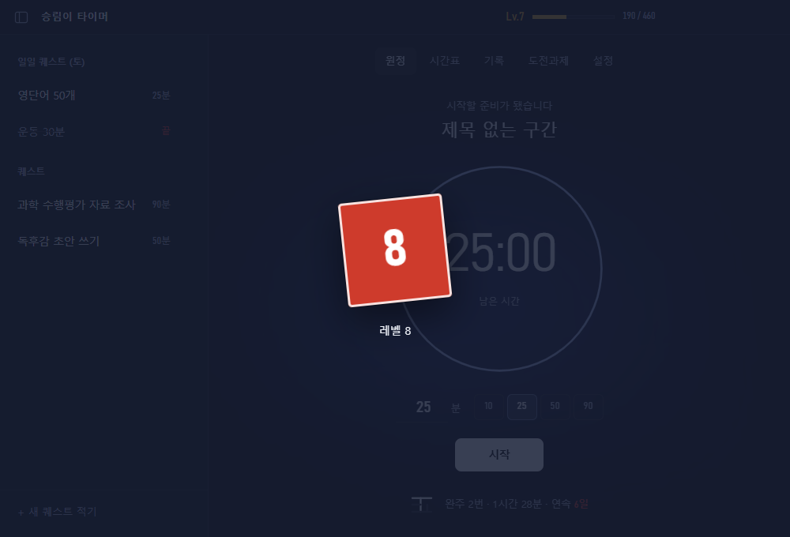
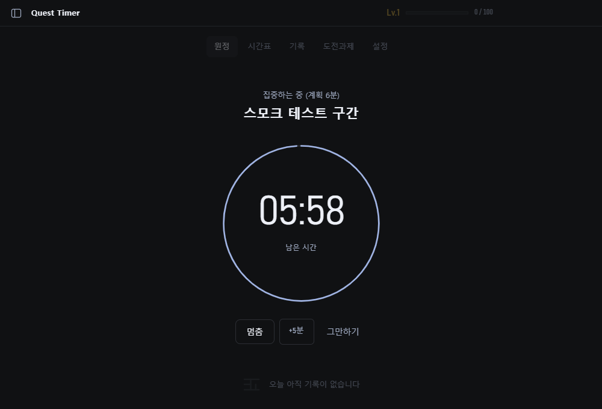
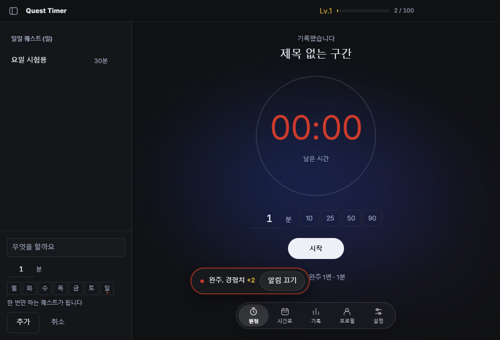

# Quest Timer

퀘스트를 깨듯 공부하는 집중 타이머. Windows 데스크톱 앱(WebView2 + .NET Framework 4.8).

할 일을 퀘스트로 적어두고, 원하는 길이만큼 타이머를 돌린다. 끝내면 경험치가
쌓이고 레벨이 오르고, 오늘 완주한 구간만큼 正자에 획이 늘어난다.



## 쓰는 법

`dist-webview2/Quest Timer 1.1.0 WebView2.zip`을 전부 풀고 `Quest Timer.exe`를 실행한다.
옆의 DLL과 `www` 폴더도 필요하다. 앱 폴더는 약 1.06 MiB, ZIP은 약 0.35 MiB다.
공유 WebView2 런타임의 설치 용량과 사용자 캐시는 이 수치에 포함되지 않는다.

Windows 10/11 x64, .NET Framework 4.8 이상, Evergreen WebView2 Runtime이 필요하다.
WebView2가 없으면 공식 다운로드 페이지를 안내한다. .NET Framework를 별도로 포함하지 않으며
Windows 11 기본 구성에서 실행할 수 있다. 실제 배포 전 대상 PC 구성은 확인해야 한다.

소스에서 빌드하려면 .NET SDK가 필요하다. NuGet의 Microsoft WebView2 SDK와
.NET Framework 참조 패키지는 첫 빌드에 내려받는다. 빌드 스크립트는 Node 없이도 실행 가능하다.

```
npm start        WebView2 빌드 후 실행
npm run dist     WebView2 폴더와 ZIP 만들기
powershell -NoProfile -ExecutionPolicy Bypass -File scripts/build-webview2.ps1
```

Electron 버전은 비교·회귀 확인용으로 남겨뒀다. `npm install`은 Electron 도구가 필요할 때만
실행한다. `npm run start:electron` / `npm run dist:electron`으로 이전 방식을 사용할 수 있다.

## 규칙

**경험치** — 집중 1분에 2점. 끝까지 완주하면 20% 더. 일일 퀘스트를 완주하면
30점이 더 붙는다.

**돌아가는 중에 +5분** — 조금만 더 하면 끝날 것 같을 때 `+5분` 을 누르면
그 구간이 5분 늘어난다. 계획과 끝나는 시각을 같은 양만큼 미루기 때문에
이미 쌓은 집중 시간은 잃지 않는다. 한 구간은 600분까지.

**완주 알림은 끌 때까지 울린다** — 시간이 다 되면 차임이 1.9초마다 반복되고
화면 아래에 `알림 끄기` 배너가 뜬다. 배너는 저절로 사라지지 않고 어느 탭에
있어도 보인다. 끄는 방법은 세 가지 — 배너의 버튼, `Esc`, `스페이스`. 새 구간을
시작하거나 설정에서 소리를 끄면 알림도 함께 멈춘다. 한 번만 울리는 소리는
자리를 비웠거나 다른 창을 보고 있으면 놓치기 때문에 이렇게 했다.

**포기해도 손해는 없다** — 50분을 걸어놓고 10분만 하고 멈춰도 20점은 그대로
들어온다. 짧게라도 앉는 편이 아예 안 하는 것보다 나으니까. 1분이 안 되는
세션만 기록하지 않는다.

**레벨** — 다음 레벨까지 `100 + (현재 레벨 - 1) × 60`점. Lv.1→2 는 100점,
Lv.9→10 은 580점. Lv.10 이면 누적 25시간쯤 된다.

**하루는 새벽 4시에 시작한다** — 자정을 기준으로 하면 밤 11시에 시작한 공부가
이틀로 쪼개지고 연속 기록이 억울하게 끊긴다. 밤샘 공부는 전날 기록으로 잡는다.
설정에서 바꿀 수 있다.

**연속일** — 하루에 20분 이상 집중하면 그날이 인정된다. 완주 여부는 보지 않는다.
아침에 아직 아무것도 안 했어도 어제까지의 기록은 그대로 보인다.

**퀘스트 두 종류** — *일일 퀘스트* 는 정해둔 요일마다 새벽 4시에 되살아난다.
*일반 퀘스트* 는 한 번 끝내면 목록에서 사라지고 기록으로 넘어간다.

**요일은 미리 짜둔다** — 시간표 탭에서 퀘스트 × 요일 격자를 채운다. 수학은
월·수·금, 영단어는 매일, 운동은 주말 같은 식으로. 원정 화면 왼쪽 목록에는
**오늘 요일에 해당하는 것만** 나오므로 지금 할 일에만 집중할 수 있다.



퀘스트를 적을 때 요일 칩이 종류 선택을 겸한다. 하나도 고르지 않으면 한 번만
하는 퀘스트, 고르면 그 요일마다 되살아나는 일일 퀘스트가 된다.

새벽 공부는 요일에도 그대로 적용된다. 월요일 새벽 2시는 일요일 기록으로
잡히니, 그때는 일요일 퀘스트가 나온다.

**도전과제** 11개. 첫 완주, 하루 네 번, 90분 한 번에, 3·7·30일 연속,
누적 10·50시간, 퀘스트 10개, Lv.10, 새벽 1시~4시 완주.

**프로필** — 레벨과 다음 레벨까지의 경험치, 누적 집중 시간, 완주 횟수,
현재·최고 연속 기록을 한눈에 본다. 도전과제는 프로필 아래에 통합되어 있다.

## 구조

```
native/         Windows 창, WebView2, 원자적 저장, 이전 기록 가져오기, 알림
src/host.js     WebView2 메시지 ↔ window.api 어댑터
main.js         이전 Electron 실행기 (비교용)
preload.js      이전 Electron의 window.api
src/game.js     경험치·레벨·연속일·도전과제 계산. DOM 을 모른다
src/renderer.js 화면과 타이머
src/styles.css  다크 모드, 원형 타이머, 잔잔한 블러와 패널 접기
test/           game.js 단위 테스트
scripts/        스크린샷·스모크 테스트 도구
```

기록은 이 컴퓨터에만 저장된다. `%APPDATA%\Quest Timer WebView2\data.json`.
임시 파일을 디스크에 먼저 쓰고 원자적으로 교체하는
방식이라 앱이 죽거나 전원이 꺼져도 파일이 반토막 나지 않고, 직전 파일을
`data.json.bak` 으로 한 벌 남긴다.

첫 실행 시 이전 `%APPDATA%\Quest Timer` 등의 `data.json` 또는 정상 백업을 복사해 가져온다.
원본은 수정하지 않으며 `electron-original.json`으로도 보관한다. 새 앱에 기록이 있으면
다시 가져오지 않는다. 이전 앱과 새 앱의 이후 기록은 동기화되지 않는다.
WebView2 프로필/캐시는 새 저장 폴더 아래 `WebView2/`에 저장된다.
기록과 백업이 모두 손상됐으면 새 데이터로 덮어쓰지 않고 오류를 표시한다.

타이머는 절대 종료 시각을 사용하고 Windows 호스트에서도 감시한다. 최소화 중에도
완주를 처리하며 절전 복귀/잠금 해제 시 재계산한다. 앱을 종료하면 진행 중 타이머도 종료된다.
완료 시 시스템 트레이 알림과 작업 표시줄 점멸을 사용한다. Windows 알림 설정에 따라
시스템 알림 표시가 제한될 수 있으며, 앱 안의 반복 소리·완료 배너는 유지된다.

레벨과 연속일은 저장하지 않는다. 누적 경험치와 세션 기록에서 그때그때 계산한다.
저장값과 계산값이 어긋날 여지를 없애기 위한 선택이다.

## 확인하는 법

```
npm test         game.js 규칙 테스트 (32개)
npm run smoke    배포한 WebView2 앱의 기록 이전·복구·+5분·최소화 완주·재로드 검증 (약 80초)
npm run shot     이전 Electron 도구로 화면을 shots/ 에 PNG 로 뜬다
npm run smoke:electron  이전 Electron 회귀 테스트
```

`npm run shot` 은 예시 데이터를 물려서 찍는다. 화면을 골라 찍을 수도 있다.

```
SHOT_VIEW=sheet   npm run shot
SHOT_VIEW=compose npm run shot
SHOT_VIEW=log     npm run shot
SHOT_VIEW=badges  npm run shot
SHOT_VIEW=prefs   npm run shot
SHOT_VIEW=seal    npm run shot
```

`npm run smoke` 는 임시 폴더에 저장하므로 평소 쓰는 기록에 손대지 않는다.
출력에 표시되는 임시 폴더의 `smoke.log`에 진행 결과가 쌓이며 스크린샷도 저장된다.
이 테스트는 사용자 기록을 읽거나 수정하지 않는다.

## 화면


|                              |                              |
| ---------------------------- | ---------------------------- |
|       |  |
|          |     |
|        |        |
|  |     |


